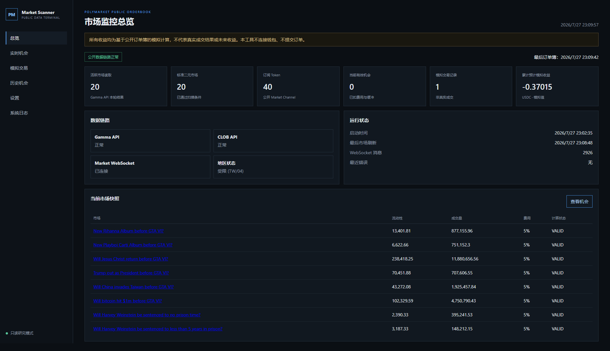
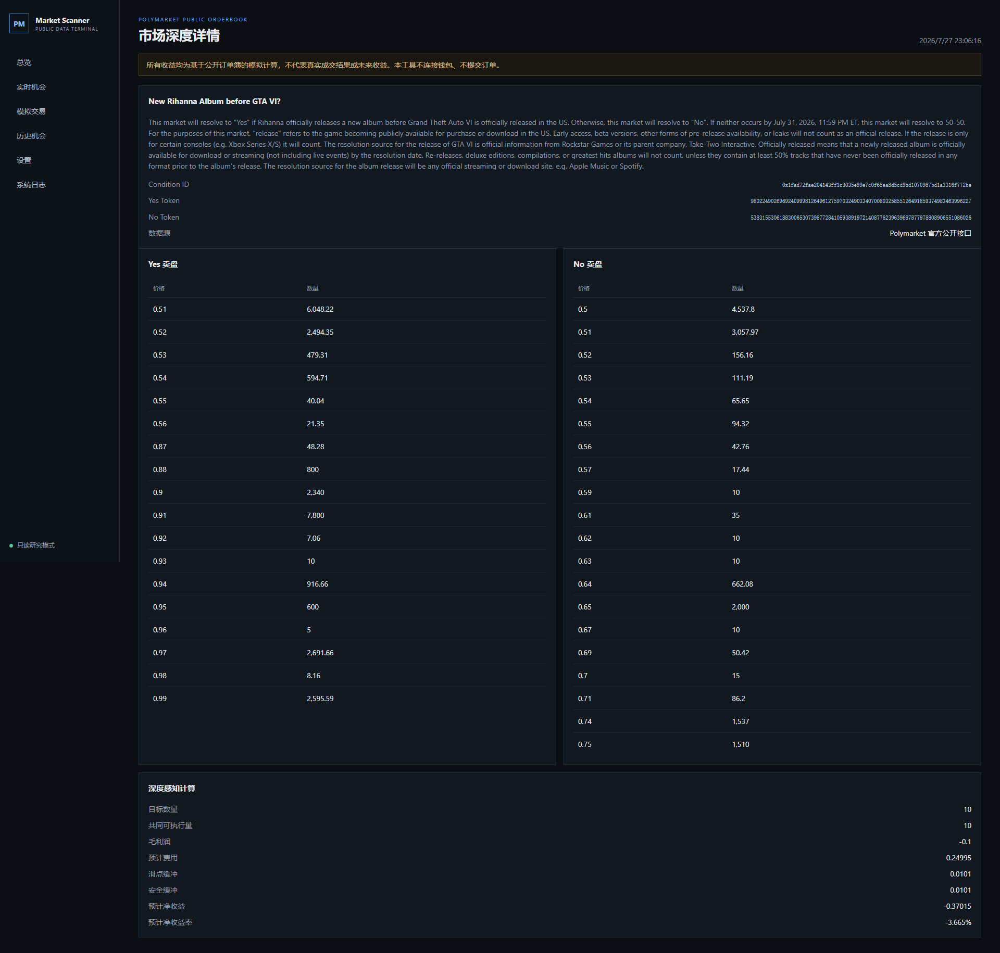
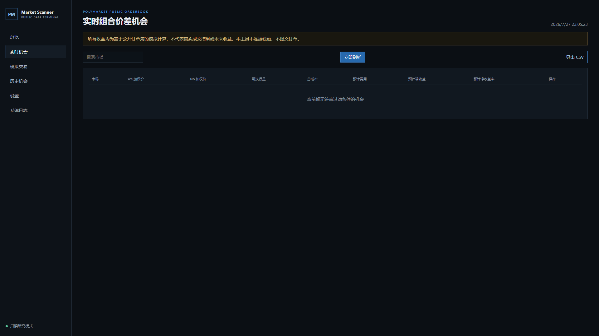
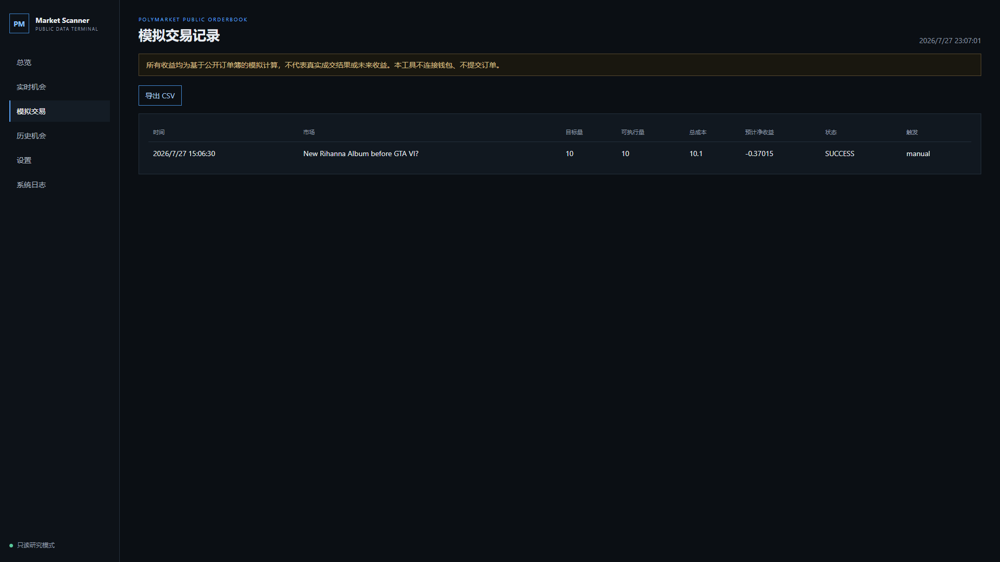

# Polymarket Market Scanner

A read-only, open-source scanner for Polymarket's official public market and CLOB data. It maps binary outcome tokens by outcome position, reads real orderbook depth, and estimates paired Yes/No paper opportunities after taker fees, slippage, and a safety buffer.

> **Research software only.** This project never connects a wallet, never requests a private key, never signs or submits an order, and never bypasses geographic restrictions. Every profit figure is a simulation based on a public orderbook snapshot—not a fill, realized return, or profit guarantee.

## Features

- Gamma market discovery with keyset pagination and robust field normalization
- Verified Yes/No outcome-to-token mapping (no fixed token-order assumption)
- CLOB batch orderbooks and a public Market WebSocket with heartbeat/reconnect
- Decimal-only depth walking, shared executable quantity, fee/buffer-aware estimates
- `FEE_UNKNOWN` fail-closed behavior: an unknown fee is never treated as zero
- Chinese dark dashboard, market depth view, history, settings, sanitized events
- SQLite persistence, paper-trade records, CSV export, retention-ready schema
- Windows scripts, Docker, CI, CodeQL, Dependabot, and a static safety scanner

## Architecture

```text
Gamma API ──> market normalization ──> binary token mapping
                                             │
CLOB REST + public Market WebSocket ──> orderbook manager
                                             │
                         fee check + depth calculator
                                             │
                          opportunity rules + SQLite
                                             │
                              FastAPI + Chinese console
```

See [architecture](docs/ARCHITECTURE.md), [API reference](docs/API_REFERENCE.md), and [calculation details](docs/CALCULATION.md).

## Screenshots









## Windows quick start

Requires Python 3.11 or 3.12.

```bat
install.bat
run.bat
```

Open <http://127.0.0.1:8000>. The installer creates an isolated `.venv`; it does not modify the global Python environment.

## Docker

```shell
docker compose up --build
```

The container runs as a non-root user and uses named volumes for `data` and `logs`.

## Configuration

Copy `.env.example` to `.env`. All settings use the `PMS_` prefix. Runtime settings such as quantity, minimum estimated profit/ROI, slippage, and safety buffer can also be persisted from the web console.

## Data and calculation

Primary sources are the official Gamma API, public CLOB read endpoints, public Market WebSocket, and the official geoblock endpoint. No web-page scraping or third-party quote feed is used. A pair is assessed across every required ask level; unfilled quantity is never included in settlement value.

```text
net estimate = executable shares - Yes cost - No cost
               - estimated taker fees - slippage buffer - safety buffer
```

If the current market fee cannot be verified, the candidate is marked `FEE_UNKNOWN`, excluded from valid opportunities, and cannot produce a successful paper record.

## Tests

```bat
lint.bat
test.bat
live_test.bat
```

The default test/CI suite uses mocks and does not access Polymarket. `live_test.bat` is explicit, read-only, requires no wallet, checks at least 20 markets and five orderbooks, and briefly connects to the public Market WebSocket.

## Security boundary

- No wallet connection, authentication client, signing dependency, or order-writing route
- No wallet secret or trading credential configuration
- No deposit, withdrawal, approval, transfer, proxy rotation, or region bypass
- Geoblock status is displayed only as a compliance notice
- Runtime data, logs, local database, `.env`, exports, and caches are ignored by Git

See [SECURITY_BOUNDARY.md](docs/SECURITY_BOUNDARY.md) and [SECURITY.md](SECURITY.md).

## Known limitations

- Public API schemas and fee schedules can change; run the live smoke test after upgrades.
- Displayed opportunities may disappear before a real-world fill and may not be executable.
- The scanner intentionally has no execution path; paper records are snapshot calculations only.
- SQLite is intended for single-instance research use, not multi-node deployment.

## Roadmap

- WebSocket delta-driven calculation with stronger out-of-order sequencing
- Configurable retention UI and richer aggregated charts
- PostgreSQL storage adapter and longer-horizon snapshot research

Contributions are welcome; read [CONTRIBUTING.md](CONTRIBUTING.md). Licensed under the [MIT License](LICENSE).
